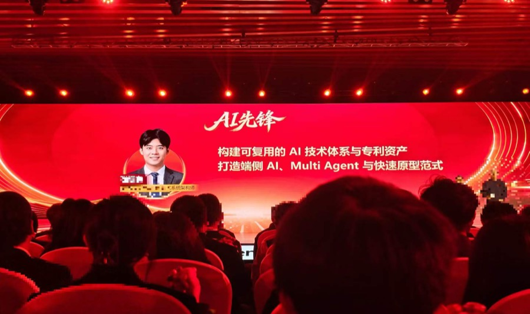
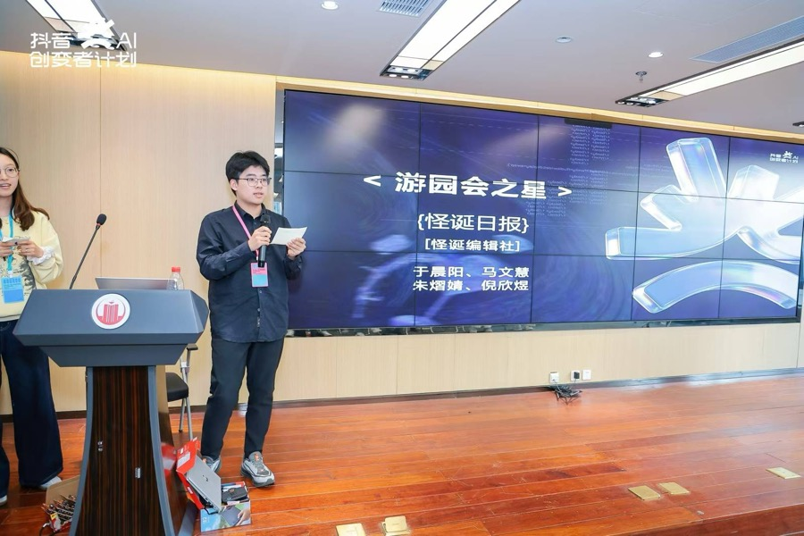
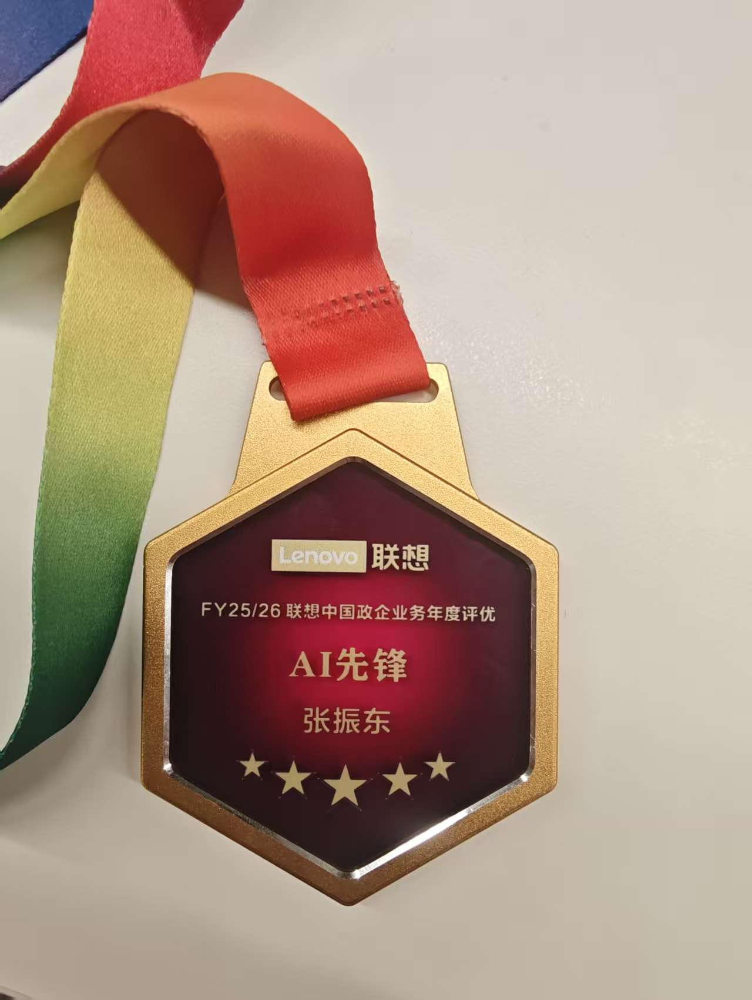
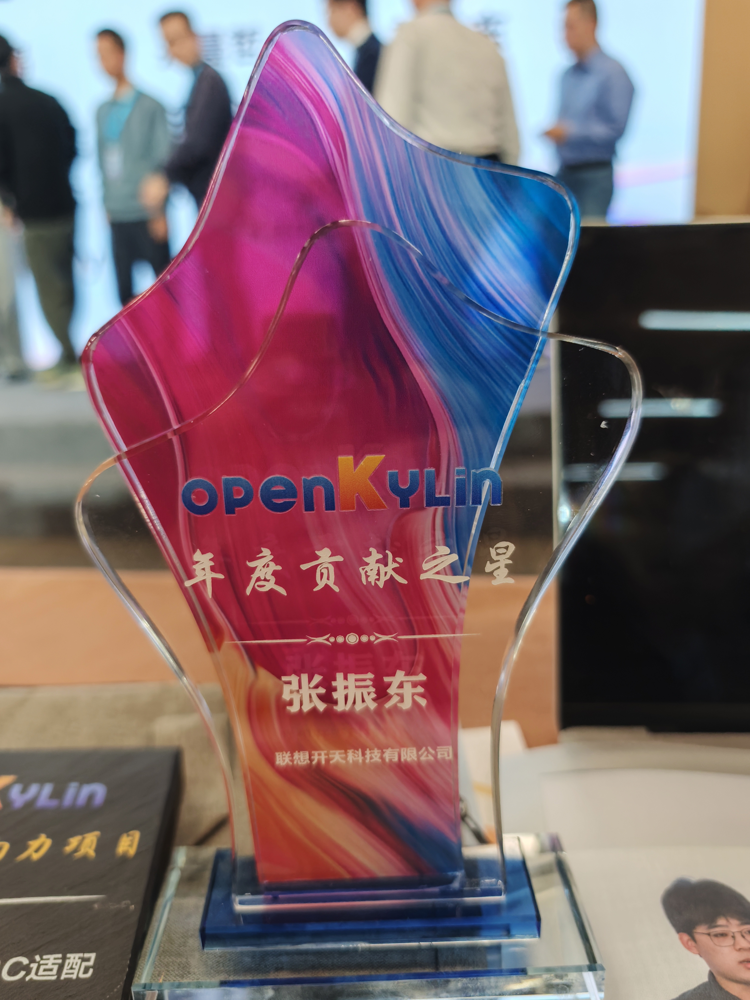

# 阿东玩 AI

**Agent 算法与架构，把长程 Agent 做到可运行、可评测、可持续演进。**

中国科学院大学（中科院自动化所）· 人工智能硕士

   <strong>BaiDu</strong> 高级 RD 
   Agent 架构师 / AI Native 创新组负责人

**EMNLP / AAAI 顶会一作**。曾带领 **8 人团队**推进 Agent 工程落地。

专注 **Harness、Memory / Context、Skills 自进化、Model Routing 与 Agent Eval**，连接算法研究、系统实现和真实业务。

[代表项目](#open-source) / [多平台与社区](#community) / [交流合作](https://ccn7vpu5l5y8.feishu.cn/wiki/XoWQwzCKciMXPJkDjHYckNLAnJc)

## Open Source

<table>
<tr>
<td width="50%" valign="top">

### [AgentGuide](https://github.com/adongwanai/AgentGuide)

**9.5k+ Stars**

从 Agent 算法到可运行系统。沉淀 Runtime、Agentic RL、RAG、数据合成与评测实践。

</td>
<td width="50%" valign="top">

### [learn-workbuddy](https://github.com/adongwanai/learn-workbuddy)

**327 Stars**

拆解桌面 Agent Harness。24 章贯穿 Agent Loop、Tool、Memory、Context、Sidecar 与沙盒审计。

</td>
</tr>
</table>

**[hybrid-router-oss](https://github.com/adongwanai/hybrid-router-oss)** · 端边云模型路由，平衡质量、成本、时延与隐私。

**[agent-ready-template](https://github.com/adongwanai/agent-ready-template)** · Harness-first 工程模板，让 Coding Agent 理解项目、遵守边界并接手开发。

## Community

**100 万+** 双平台技术受众。以「阿东玩 AI」持续分享 Agent 工程、大模型实践与 AI 产品探索。

  <a href="https://www.douyin.com/user/MS4wLjABAAAAFqjHp1IIOVdpXdbIzlROaoS1wLpWCfz442x6s2MLaJU"> <strong>抖音</strong></a> &nbsp; / &nbsp;
  <a href="https://mp.weixin.qq.com/s/x_aVihPiiNGRezICZ7k7eA"> <strong>微信公众号</strong></a> &nbsp; / &nbsp;
  <a href="https://www.xiaohongshu.com/user/profile/5f310fd50000000001009df5"> <strong>小红书</strong></a>

### 阿东的大模型实验室

**欢迎加入阿东的大模型实验室社区。** 围绕大模型、RAG、Agent、训练推理与评测，分享学习路线、项目实战和论文解读，一起交流工程经验、共建知识、探索 AI 产品。

**[了解社区与加入须知](https://ccn7vpu5l5y8.feishu.cn/wiki/Uu5Pwkcjwio10ZkC82tct3MSn8i)**

### 分享与荣誉

面向 Lenovo 集团 **300+ 人**开展 **4 次** Agent 技术分享，并在多项 AI 黑客松担任分享嘉宾。

  
  

**Outstanding** / Lenovo 中国 AI 先锋奖 / 年度专业贡献项目奖

<strong>更多荣誉与活动</strong>

- 2025 开放原子开发者大会杰出贡献奖暨分享嘉宾
- 开放原子开源社区年度贡献之星
- 中科院 MCP 云服务赛三等奖
- 算法设计与编程挑战赛银奖

  
  

[完整活动记录](https://ccn7vpu5l5y8.feishu.cn/wiki/XoWQwzCKciMXPJkDjHYckNLAnJc)

---

[个人网站](https://adongwanai.github.io/) / [开源交流](https://github.com/adongwanai/AgentGuide/issues)
